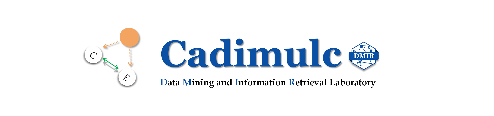
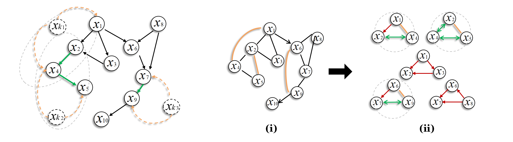

# Hybrid-Based Causal Discovery by Cadimulc
<div  align="center"> 

</div>

CADIMULC is a Python package standing for: **CA**usal **DI**scovery 
with **M**ultiple **L**atent **C**onfounders, providing easy-to-use light APIs 
to learn an empirical causal graph from generally raw data with relatively efficiency.

The package integrates implementations of **hybrid-based approaches** involving
the popular [MLC-LiNGAM algorithm](https://scholar.google.com/scholar?hl=en&as_sdt=0%2C5&q=Causal+discovery+in+linear+non-gaussian+acyclic+model+with+multiple+latent+confounders&btnG=),
along with the "micro" **workflow of causal discovery**, such as data generation, learning results evaluation, and graphs visualization.


For more information:
* **Documentation**: https://xuanzhichen.github.io/cadimulc/
* **Paper Presentation, Uploaded in 2024**
  *  **YouTube**: https://www.youtube.com/watch?v=4bpx1DPd_Vg&list=PLSyPZ5M_YtDRr9z25YgUjqs7-RLr-x5yg&index=1&t=2s
  *  **Bilibili**: https://www.bilibili.com/video/BV1gj421R77K/?spm_id_from=333.999.0.0&vd_source=3a33cc764e3d6ab04b5c05c8a0d064da

## Who We Are?
The hybrid methodology built in CADIMULC refers to the causal discovery framework that was early proposed and
developed by the  **Data Mining and Information Retrieval** laboratory (DMIR lab, PI: [Ruichu Cai](https://ruichucai.github.io/)).
The lab has also been collaboratively developing [causal-learn](https://github.com/py-why/causal-learn) (Python package for causal discovery) by CMU.

[Xuanzhi Chen](https://xuanzhichen.github.io) is currently the owner of the repository, but
maintenance and updates might not be timely since CADIMULC is limited in personal development. 
Xuanzhi Chen is sorry about that, but efforts of opening the issue and 
advancing the causal discovery community are always welcomed.
(Reach Out: <xuanzhichen.42@gmail.com>)

## When Might I Need CADIMULC?
Suppose you only have a dataset with respect to 10 variables you are interest in,
you could use CADIMULC if you believe the causal relations with respect to the 10 variables 
can be automatically discovered from the data itself.

Aside for these 10 variables, are there exist additionally unobserved variables that associates with 
the dataset in reality? Is the causal relation the linear relation, or the non-linear one?

These are important questions before one begins. Yet CADIMULC is developed for deal with the concerns,
so that users are able to start **causal discovery** straightforwardly.

## Overview
### What Is the Hybrid-Based Approach in Causal Discovery?
In fields of causal discovery, 
**conditional-independence-test (CIT)** based methods
and **functional-causal-models (FCMs)** based methods
are the dominantly popular methodology over the last two decades.

Representative hybrid-based causal discovery algorithms, such as 
SADA [1], MLC-LiNGAM [2], and Nonlinear-MLC [3], are meant to hybridize the advantages of the two theory.

The following picture shows the **theory blueprint** for the algorithmic programming:

<div  align="center"> 

</div>

> For details, please refer to
the main idea 
in CADIMULC's [related paper](https://xuanzhichen.github.io/work/papers/nonlinear_mlc.pdf), Section 4.

1. resort to CIT approaches to construct **network skeleton** (i); 
2. apply FCMs approaches based on the well-known **divide-and-conquer** strategy (ii).

### The Defining Feature of Cadimulc
Equipped with the repertoire of hybrid-based approaches, 
CADIMULC further focuses on the algorithmic efficiency and robustness in general causal discovery.
Namely, to relatively relax causal assumptions, such as causal sufficiency and linearity, upon the data.
For example:

- given **common disturbance** from the **multiple unknown factor**;
- given the "generic" **non-linear relation** entailed by data.

Thus, causal discovery by CADIMULC is still anticipated to be 
relatively scalable in computation and reliable in performance under these challenges.

### Main Modules for the "Micro" Workflow of Causal Discovery

|             **Module**             |   **Workflow**   |                                  **Description**                                  |
|:----------------------------------:|:----------------:|:---------------------------------------------------------------------------------:|
|  **hybrid_algorithms.MLCLiNGAM**   | Causal Discovery |   The hybrid-based causal discovery algorithm adaptive to linear data relations   |
| **hybrid_algorithms.NonlinearMLC** | Causal Discovery | The hybrid-based causal discovery algorithm adaptive to non-linear data relations |
|        **utils.Generator**         | Data generation  |                  Simulation for Structural Causal Models (SCMs)                   | 
|        **utils.Evaluator**         |    Evaluation    |  Causal graph evaluation akin to the common evaluation used in machine learning   |


## Get Start
The following packages are required before the CADIMULC installation:
- python
- causallearn
- sklearn
- pygam
- numpy
- networkx

To install CADIMULC, run the following command from your Python virtual environment:

```commandline

pip install cadimulc

```

## Citation
- Please cite the following paper if you would like to use the MLC-LiNGAM approach in your reports or publications:
```
@article{chen2021causal,
  title={Causal discovery in linear non-gaussian acyclic model with multiple latent confounders},
  author={Chen, Wei and Cai, Ruichu and Zhang, Kun and Hao, Zhifeng},
  journal={IEEE Transactions on Neural Networks and Learning Systems},
  volume={33},
  number={7},
  pages={2816--2827},
  year={2021},
  publisher={IEEE}
}
```

- The [paper](https://xuanzhichen.github.io/work/papers/nonlinear_mlc.pdf) for the Nonlinear-MLC approach is unpublished. You could choose to give this repository a star if you find it okay. Your support is greatly appreciated for Xuanzhi Chen.

## License
Copyright (C) 2022-2024 Xuanzhi Chen (DMIR lab, Guangdong University of Technology, China)

CADIMULC is downloaded for free, provided "as is" WITHOUT ANY EXPRESS OR IMPLIED WARRANTY;
CADIMULC is developed in hope of being beneficial for empirical data analysis in causation, but WITHOUT WARRANTY OF ABSOLUTELY ACCURATE INTERPRETATION.

## Acknowledgements
Xuanzhi Chen would like to thank the DMIR laboratory for offering him research opportunities, 
with special thanks to Ruichu Cai (蔡瑞初) of the lab director and Dongning Liu (刘冬宁) of the dean in School of Computer.

Jie Qiao (乔杰) and Zhiyi Huang (黄智毅) were willing to spend their time in personal discussions with Xuanzhi Chen 
about details in the paper;
Zhengming Chen (陈正铭) patiently helped point out initial mistakes in the paper;
thanks to other graduate students, such as Zeqin Yang (杨泽勤), Zhengting Huang (黄正婷), Xiaokai Huang (黄晓楷), and Yu Xiang (向宇),
for their generosity of teaching when Xuanzhi chen was initially building the CADIMULC repository.

Finally,
Xuanzhi Chen owes a great debt to his advisor Wei Chen (陈薇) for her encouragement 
when Xuanzhi started studying causation two years ago
— "Do it, just have your own interest of research and your own rhythm of lifetime".

## Reference
[1] Cai, Ruichu, Zhenjie Zhang, and Zhifeng Hao. 
[Sada: A general framework to support robust causation discovery.](https://scholar.google.com/scholar?hl=en&as_sdt=0%2C5&q=Sada%3A+A+general+framework+to+support+robust+causation+discovery.&btnG=)
*International conference on machine learning, PMLR.* 2013.

[2] Chen, Wei, Ruichu Cai, Kun Zhang, and Zhifeng Hao.
"[Causal discovery in linear non-gaussian acyclic model with multiple latent confounders. ](https://scholar.google.com/scholar?hl=en&as_sdt=0%2C5&q=Causal+discovery+in+linear+non-gaussian+acyclic+model+with+multiple+latent+confounders&btnG=#d=gs_cit&t=1711554753714&u=%2Fscholar%3Fq%3Dinfo%3AzEuwtDsRA24J%3Ascholar.google.com%2F%26output%3Dcite%26scirp%3D0%26hl%3Den)"
*IEEE Transactions on Neural Networks and Learning Systems.* 2021.

[3] Chen, Xuanzhi, Wei Chen, Ruichu Cai. 
"[Non-linear Causal Discovery for Additive Noise Model with
    Multiple Latent Confounders](https://xuanzhichen.github.io/work/papers/nonlinear_mlc.pdf)". *Xuanzhi's Personal Website.* 2023.
