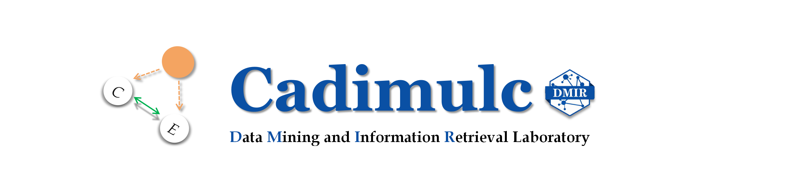
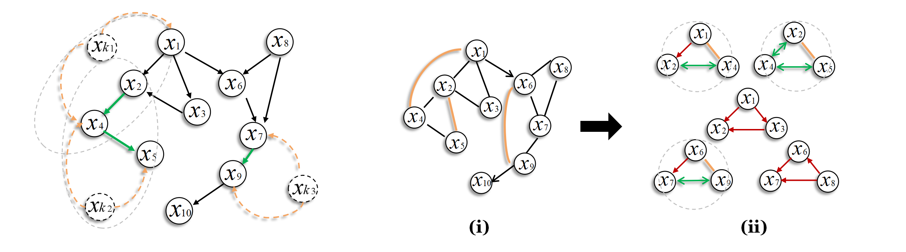

# Introduction
<div  align="center"> 

</div>

CADIMULC is a Python package standing: **CA**usal **DI**scovery 
with **M**ultiple **L**atent **C**onfounders, providing easy-to-use light APIs 
to learn an empirical causal graph from generally raw data with relatively efficiency.
It integrates implementations of **hybrid-based approaches** involving
the popular [MLC-LiNGAM algorithm](https://scholar.google.com/scholar?hl=en&as_sdt=0%2C5&q=Causal+discovery+in+linear+non-gaussian+acyclic+model+with+multiple+latent+confounders&btnG=),
along with the "micro" **workflow of causal discovery**, such as data generation, learning results evaluation, and graphs visualization.

## Who We Are?
The hybrid methodology built in CADIMULC refers to the causal discovery framework that was early proposed and
developed by the  **Data Mining and Information Retrieval** laboratory (DMIR lab, PI: [Ruichu Cai](https://ruichucai.github.io/)).
The lab has also been collaboratively developing [causal-learn](https://github.com/py-why/causal-learn) (Python package for causal discovery) by CMU.

[Xuanzhi Chen](https://xuanzhichen.github.io) is currently the owner of the repository, but
maintenance and updates might not be timely since CADIMULC is limited in personally developed. 
Xuanzhi Chen is sorry about that, but efforts of opening the issue and 
advancing the community are always welcomed.
(Reach Out: <xuanzhichen.42@gmail.com>)

##  Overview
### What Is the Hybrid-Based Approach in Causal Discovery?
In fields of causal discovery, 
**conditional-independence-test (CIT)** based methods
and **functional-causal-models (FCMs)** based methods
are the dominantly popular methodology over the last two decades.
Representative hybrid-based causal discovery algorithms, such as 
SADA [1] and MLC-LiNGAM [2], are meant to hybridize the advantages of the two theory.

The following picture shows the **theory blueprint** for the algorithmic programming:

<div  align="center"> 

</div>

> For details, please refer to
the main idea 
in CADIMULC's [related paper](https://xuanzhichen.github.io/work/papers/nonlinear_mlc.pdf), Section 4.

1. resort to CIT approaches to construct **network skeleton**; 
2. apply FCMs approaches based on the well-known **divide-and-conquer** strategy.

[//]: # (for CADIMULC's algorithmic programming)

### The Defining Feature of Cadimulc
Equipped with the repertoire of hybrid-based approaches, 
CADIMULC further focuses on the algorithmic efficiency and robustness in general causal discovery.
Namely, relatively relax causal assumptions, such as causal sufficiency and linearity, upon the data.
For example:

- given **common disturbance** from the **multiple unknown factor**;
- given the "generic" **non-linear relation** entailed by data.

Causal discovery by CADIMULC is still anticipated to be relatively scalable in computation and reliable in performance.

### Modules for the "Micro" Workflow of Causal Discovery    
Write down the descriptions here.

|             **Module**             |   **Workflow**   |                  **Description**                   |
|:----------------------------------:|:----------------:|:--------------------------------------------------:|
|        **utils.Generator**         | Data generation  |                        test                        | 
|  **hybrid_algorithms.MLCLiNGAM**   | Causal Discovery |                        test                        |
| **hybrid_algorithms.NonlinearMLC** | Causal Discovery | partial directed graph entailed by non-linear data | 
|        **utils.Evaluator**         |    Evaluation    |                        test                        |  
|  **utils.draw_graph_from_array**   |  Visualization   |                        test                        | 

## Citation
Please cite the following paper(s) depending on which approach you use in your reports or publications:
```
@article{chen2021causal,
  title={Causal discovery in linear non-gaussian acyclic model with multiple latent confounders},
  author={Chen, Wei and Cai, Ruichu and Zhang, Kun and Hao, Zhifeng},
  journal={IEEE Transactions on Neural Networks and Learning Systems},
  volume={33},
  number={7},
  pages={2816--2827},
  year={2021},
  publisher={IEEE}
}
```

## License
Copyright (C) 2022-2024 Xuanzhi Chen (DMIR lab, Guangdong University of Technology, China)

CADIMULC is downloaded for free, provided "as is" WITHOUT ANY EXPRESS OR IMPLIED WARRANTY;
CADIMULC is developed in hope of being beneficial for empirical data analysis in causation,
but WITHOUT WARRANTY OF ABSOLUTELY ACCURATE INTERPRETATION.

## Reference
[1] *Cai, Ruichu, Zhenjie Zhang, and Zhifeng Hao.* 
[Sada: A general framework to support robust causation discovery.](https://scholar.google.com/scholar?hl=en&as_sdt=0%2C5&q=Sada%3A+A+general+framework+to+support+robust+causation+discovery.&btnG=)
*International conference on machine learning, PMLR. 2013.*

[2] *Chen, Wei, Ruichu Cai, Kun Zhang, and Zhifeng Hao.*
[Causal discovery in linear non-gaussian acyclic model with multiple latent confounders. ](https://scholar.google.com/scholar?hl=en&as_sdt=0%2C5&q=Causal+discovery+in+linear+non-gaussian+acyclic+model+with+multiple+latent+confounders&btnG=#d=gs_cit&t=1711554753714&u=%2Fscholar%3Fq%3Dinfo%3AzEuwtDsRA24J%3Ascholar.google.com%2F%26output%3Dcite%26scirp%3D0%26hl%3Den)
*IEEE Transactions on Neural Networks and Learning Systems. 2021.*