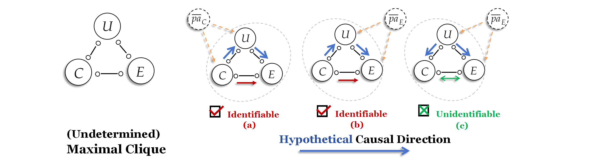
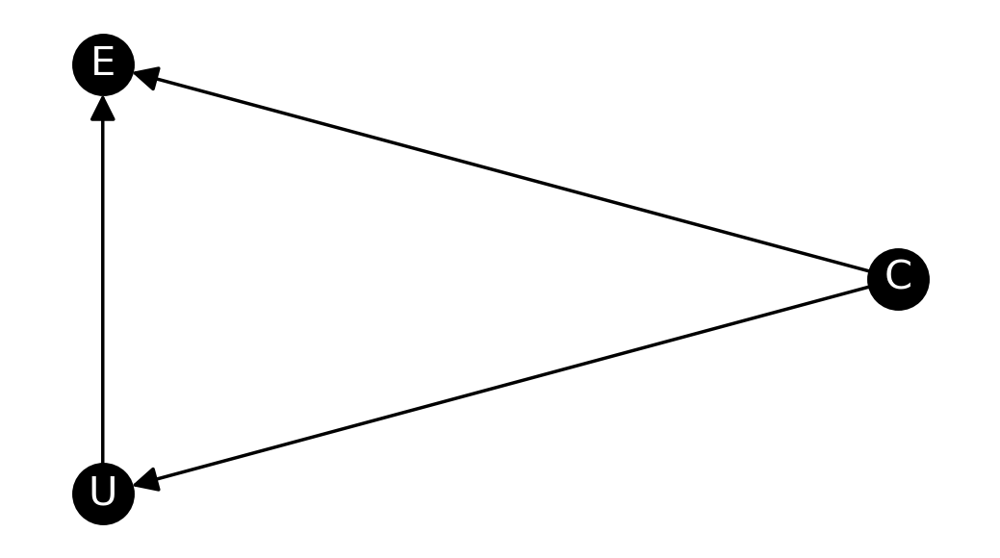
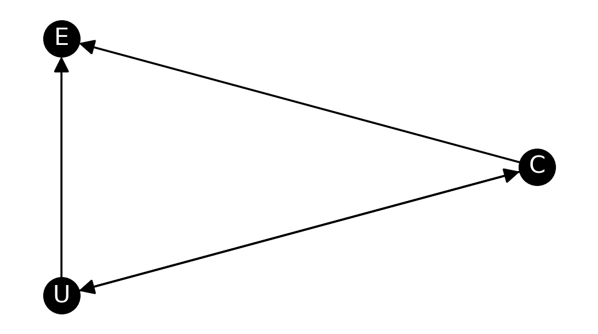
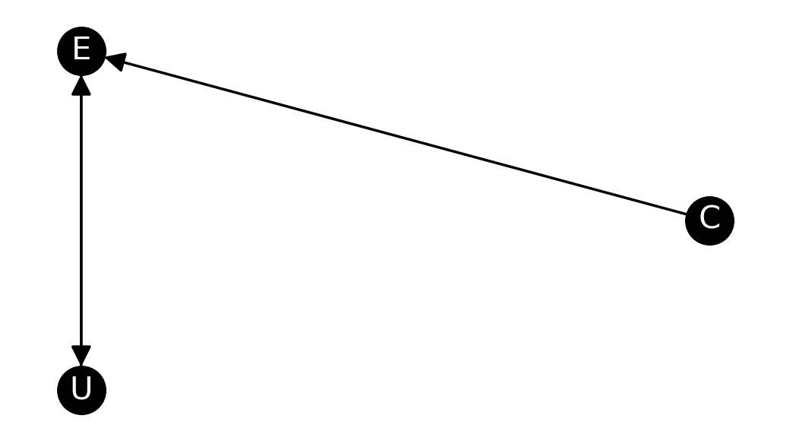
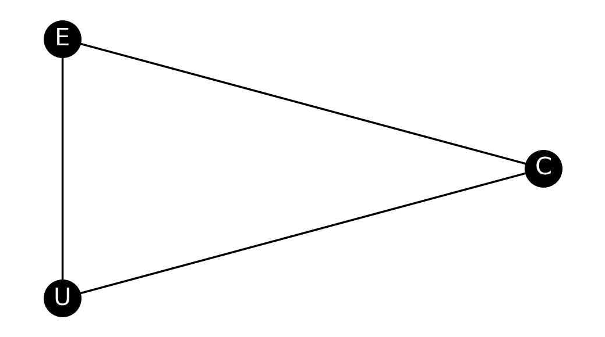

# Quick Tutorials
Here is a simple example to help you take a look on the "micro" workflow of the 
causal discovery task. Attaching to this "mini" procedure by CADIMULC, 
you would experience how to complete the basic causal discovery in minutes.

## 1. Installation

To install CADIMULC, run the following command from your Python virtual environment:

```commandline

pip install cadimulc

```

## 2. Hybrid-Based Causal Discovery
Causal discovery algorithms (`MLCLiNGAM`, `NonlinearMLC`) in CADIMULC provide you an out-of-box **hybrid framework** to combine 
the two lines of state-of-art causal structure learning methodology: 
**constraint-based methods** and **functional-based methods**.
```python
# hybrid-algorithms based on data assumptions: linearity or non-linearity
from cadimulc.hybrid_algorithms import MLCLiNGAM, NonlinearMLC
```
### 2.2 Data Fitting
Applying the hybrid-based approaches is super easy. Take `NonlinearMLC`.
```python
nonlinear_mlc = NonlinearMLC()
```

We have adjusted and set up for the technical parameters in hybrid-based causal discovery, with respect to 
the **conditional-independence-test (CIT)** type in constraint-based methods, 
and the **functional-causal-models (FCMs)** type in functional-based methods.
```python
# NonlinearMLC uses the well-known kernel-based CIT for nonlinear data. 
nonlinear_mlc.ind_test
>>> 'kernel_ci'  

# NonlinearMLC uses the well-known general additive models for FCMs regression.
nonlinear.regressor
>>> LinearGAM()  

```

We can directly conduct non-linear causal discovery on the `dataset` we want to analyze.
```python
# Perform the Nonlinear-MLC causal discovery algorithm.
nonlinear_mlc.fit(dataset=dataset)
```
That's it. The `fit` procedure has involved a two-steps hybrid causal discovery strategy. 

However, if you would like to presume linearity relations entailed by the `dataset`, you could
simply replace `NonlinearMLC` as `MLCLiNGAM`, and repeat the same steps.

```python
# Perform the MLC-LiNGAM causal discovery algorithm.
mlc_lingam = MLCLiNGAM()
mlc_lingam.fit(dataset=dataset)
```
For technical usages and theoretical details,
please refer to [Hybrid-Based Approaches](https://xuanzhichen.github.io/cadimulc/hybrid_algorithms/).

<!--
!!! warning "Causal discovery with latent confounders"
    CADIMULC features the algorithm that can handle multiple latent confounders. 
    However, it is a pity that this fact is not easy to be seen for intuitive demonstration.
    Reasons are partially summarized in <font color="red">Important Usage Advice</font>.
-->

### 2.2 Simple Visualization
CADIMULC offers a simple function to plot the causal graph discovered by the algorithms.
```python
from cadimulc.utils.visualization import draw_graph_from_ndarray
import matplotlib.pyplot as plt
```
The causal graph is stored in form of an adjacency matrix inside the algorithm instance,
so you need to input that adjacency matrix to the plot function.
```python 
array = nonlinear_mlc.adjacency_matrix_
draw_graph_from_ndarray(array)
plt.show()
```

## 3. Data Generation
Data Generation in step-3 is not a must, 
we can directly apply the algorithm in step-2 for established datasets.
**Tutorials for step-3 emphasizes that the data generation setting
essentially reflects our priori causal assumption**. 

Nevertheless, the assumption does not necessarily hold over the established dataset we want to analyze. 
**Keeping this in mind might be helpful for us
to objectively interpret the hypothetical causation learned from the empirical data**.
### 3.1 Simple Clique Structure
Let's do an example in action.

The following picture shows the example in the [relevant paper](https://xuanzhichen.github.io/work/papers/nonlinear_mlc.pdf), where we demonstrate causal
discovery on a clique structure (e.g. all the variables in a clique are connected in pairs).

<div  align="center"> 

</div>

> A toy graphical structure, namely the clique = $\{C, E, U\}$, illustrates how to determine non-linear
identifiability under latent confounding ($\overline{pa}_C$ or $\overline{pa}_E$) in cases (a), (b), and (c).

#### 3.1.1 Causal Sufficiency
The causal sufficiency, namely considering the data generation without latent confounding.

Let's take a quick look for the following code ignoring some details in the paper.
For example, we simulate the data generation in figure (a) without (the latent confounder) $\overline{pa}_C$.
```python linenums="1"
import numpy as np

# Fine-tune the data generation by scaling.
def scaling(variable, scale):
    return variable * scale

sample = 2000

np.random.seed(42)

# Simulate the data generation with non-linear functional relations.
c = np.random.normal(size=sample) 
u = scaling(np.cos(c), 1) + scaling(np.random.normal(size=sample), 0.1)
e = scaling(np.sin(c), 1) + np.sin(u) + scaling(np.random.normal(size=sample), 0.1)

dataset_a_without_confounding = np.array([c, e, u]).T
```
The dataset entails non-linear causal relations, 
so that we could try `NonlinearMLC` on it.
```python
nonlinear_mlc.fit(dataset=dataset_a_without_confounding)
```
The following shows the visualization after applying `NonlinearMLC`.
```python linenums="1"
array = nonlinear_mlc.adjacency_matrix_
draw_graph_from_ndarray(
    array=array, 
    # Rename the graph nodes to consist with the data column.
    rename_nodes=['C', 'E', 'U']   
)
plt.show()
```
<div  align="center"> 

</div>

`NonlinearMLC` uncovers the non-linear causal relation from the data!
The figure illustrates a directed acyclic graph (DAG) representing the causal graph.

#### 3.1.2 Latent Confounders
Next, let's do a bit of modification for the above data generation code. 
In other words, 
we simulate the data generation in figure (a) with the latent confounder $\overline{pa}_C$.

!!! note "Causal discovery with latent confounders"
    CADIMULC features the algorithm that can handle multiple latent confounders. 
    For simplify, our demonstration here only describes the cases with a single latent confounder.

```python linenums="1"
np.random.seed(42)

# Add an unobserved parent variable. 
pa_c = np.random.normal(size=sample)

# Simulate latent confounding to the data generation.
c = np.random.normal(size=sample) + scaling(pa_c, 0.5)
u = scaling(np.cos(c), 1) + scaling(np.random.normal(size=sample), 0.1) + scaling(pa_c, 0.5)
e = scaling(np.sin(c), 1) + np.sin(u) + scaling(np.random.normal(size=sample), 0.1)

dataset_a_with_confounding = np.array([c, e, u]).T
```
Conduct `NonlinearMLC` again, and visualize the causal graph we have discovered.
```python
nonlinear_mlc.fit(dataset=dataset_a_with_confounding)

draw_graph_from_ndarray(
    array=nonlinear_mlc.adjacency_matrix_, 
    rename_nodes=['C', 'E', 'U']   
)
plt.show()
```

<div  align="center"> 

</div>

Notice that this time we get a **partial directed acyclic graph** as the output of `NonlinearMLC`.
That is, the fact, where the bi-directed edge $U \leftrightarrow C$ that cannot be determined by `NonlinearMLC`,
suggests the existence of latent confounder.

Remarkably, the edge $C \rightarrow E$ (cause -> effect) is still identifiable, 
even if the **indirected latent confounding** $C \leftarrow \overline{pa}_C \rightarrow U \rightarrow E$ persists
between $C$ and $E$.

The edge $C \rightarrow E$ (cause -> effect) retains the identifiability as well when it comes
to the simulation in figure (b).

```python linenums="1"
np.random.seed(42)

pa_e = np.random.normal(size=sample) 

c = np.random.normal(size=sample) 
u = scaling(np.cos(c), 10) + scaling(np.random.normal(size=sample), 0.1) + scaling(pa_e, 0.5)
e = scaling(np.sin(c), 10) + np.sin(u) + scaling(np.random.normal(size=sample), 0.1) + scaling(pa_e, 10)

dataset_b_with_confounding = np.array([c, e, u]).T

nonlinear_mlc.fit(dataset=dataset_b_with_confounding)

draw_graph_from_ndarray(
    array=nonlinear_mlc.adjacency_matrix_, 
    rename_nodes=['C', 'E', 'U']   
)
plt.show()
```

<div  align="center"> 

</div>

!!! warning "Fine-tune the generation setting"
    We fine-tune the scale of the "causal strength" among variables. 
    Technical procedures (such as independence tests and regression) involved in hybrid-based causal
    discovery algorithms are relatively sensitive to the empirical data.
    See more in <font color="red">Important Usage Advice</font> at the bottom of this page.

Notice that the result shows an unfaithful fact: the edge between $C$ and $U$
does not be learned by the algorithm. This is excusable, as it is known that the causal assumption 
in constraint-based methods such as **causal faithfulness** is untestable in practical.

Of course, here we could not discuss a lot about it in this short tutorial. 

The primary observation is that 
the edge $C \rightarrow E$ keeps identifiable in figure (b) under the latent
confounding resulted from $\overline{pa}_E$.

Conversely, we will get a different result for another simulation in figure (c).
```python linenums="1"
np.random.seed(42)

pa_e = np.random.normal(size=sample) 

u = scaling(np.random.normal(size=sample), 0.1) + scaling(pa_e, 0.5)
c = np.random.normal(size=sample) + scaling(np.cos(u), 10)
e = scaling(np.sin(c), 10) + np.sin(u) + scaling(np.random.normal(size=sample), 0.1) + scaling(pa_e, 10)

dataset_c_with_confounding = np.array([c, e, u]).T

nonlinear_mlc.fit(dataset=dataset_c_with_confounding)

draw_graph_from_ndarray(
    array=nonlinear_mlc.adjacency_matrix_, 
    rename_nodes=['C', 'E', 'U']   
)
plt.show()
```

<div  align="center"> 

</div>

`NonlinearMLC` outputs an undirected graph (though the edge between $C$ and $U$ should have been identified). 
But the point is, the edge $C \rightarrow E$ , unfortunately, becomes **unidentifiable** if 
the latent confounding occurs in the way of figure (c).

<font color="red">
For brief summary: 
Being able to help you clearly differentiate the (causal graph) identifiable nonlinear-dataset from another, with the presence of latent confounding,
is the essence as to the [relevant paper](https://xuanzhichen.github.io/work/papers/nonlinear_mlc.pdf)
and the algorithmic programming in CADIMULC.
</font>


### 3.3 Structural Causal Models
Tutorials in 3.1 tell us that, 
in order to discover a "causal structure" from data, we might first need to learn about how to
generate the data. 

In causation, this refers to how the Nature generates the data based on a "**structural causal model (SCM)**".
You could use the ``Generator`` module in CADIMULC to learn 
how to uniformly simulate the empirical data that entails causation.
```python
from cadimulc.utils.generation import Generator
```
For example, 
let us simulate an empirical dataset consisting of 3 variables (``graph_node_num=3``), with the 
sample size equal to 1000 (``sample=2000``).
```python linenums="1"
# CADIMULC uses the two following libraries for random graph simulation.
import numpy.random
import random

# Simultaneously fix them before you would like to test the Generator.
numpy.random.seed(42)
random.seed(42)

# Default simulation setting as to a "learnable" SCM.
generator = Generator(
        graph_node_num=3,  
        sample=2000,
        causal_model='hybrid_nonlinear',
        noise_type='Gaussian'
    )

# Simulation results: truth causal structure and empirical dataset.
ground_truth, dataset = generator.run_generation_procedure().unpack()

```
The other parameters, such as ``causal_model`` and ``noise_type``, specify a "learnable" SCM, which
refers to the special **additive models** compared with the general SCMs spectrum.
See [SCMs Data Generation](https://xuanzhichen.github.io/cadimulc/generation/) for a brief introduction.

Now we could similarly apply the hybrid algorithms on the dataset we generate.
We also have the ``ground_truth`` as the causal structure relative to the dataset.

[//]: # (The truth causal graph relative to the 5 variables serves as a representation for a "learnable" SCM.)
[//]: # (which reflects our **priori causal assumption** towards to the data generation.)

## 4. Evaluation
If we have the ground-truth with respect to the causal relations we are interested in,
then we can evaluate the estimated causal graph by using the evaluation module in CADIMULC.

```python
from cadimulc.utils.evaluation import Evaluator
```
By simply inputting two of the adjacency matrices representing the ground-truth and the estimated causal graph
respectively, `Evaluator` will calculate the metrics relative to causal graphs,
akin to the common indicators used in machine learning, such as
**causal edge precision**, **causal edge recall**, and **causal edge f1-score**.
```python linenums="1"
causal_edge_precision = Evaluator.precision_pairwise(
        true_graph=ground_truth,
        est_graph=nonlinear_mlc.adjacency_matrix_
)

causal_edge_recall = Evaluator.recall_pairwise(
        true_graph=ground_truth,
        est_graph=nonlinear_mlc.adjacency_matrix_
)

causal_edge_f1_score = Evaluator.f1_score_pairwise(
        true_graph=ground_truth,
        est_graph=nonlinear_mlc.adjacency_matrix_
)

print(causal_edge_precision, causal_edge_recall, causal_edge_f1_score)
```
To see more usages and details, please refer to [Evaluation and Visualization](https://xuanzhichen.github.io/cadimulc/evaluation/)

## <font color="red">5. Important Usage Advice</font>
<font color="red">
**Notice that the "micro" causal discovery workflow is only for the purpose of demonstration**. 
Technically speaking, mainstream causal discovery algorithms are "noise-driven" algorithms, 
thus the performance of the algorithm is usually susceptible to the parameters of data generation. 

[Development Testing](https://github.com/xuanzhichen/cadimulc/blob/master/tests/test_hybrid_algorithms.py) and 
the [relevant paper](https://xuanzhichen.github.io/work/papers/nonlinear_mlc.pdf) 
also show that data simulation in ``Generator`` might be over-rigorous that
few causal algorithms perform well on that simulation dataset.

Yet if developers would like to refer to this workflow, the following advice might be helpful:

- Fine-tune the built-in simulation function in the source code of ``Generator``, so that it
fits the best with your domain knowledge. **Simulation in CADIMULC wishes to
provide you a causation generation framework, NOT a causation generation standard**;

- Filter out some "unlearnable" generation dataset by running a series of random seed;

- Make sure you have involved other causal discovery methods as the baseline.
</font>